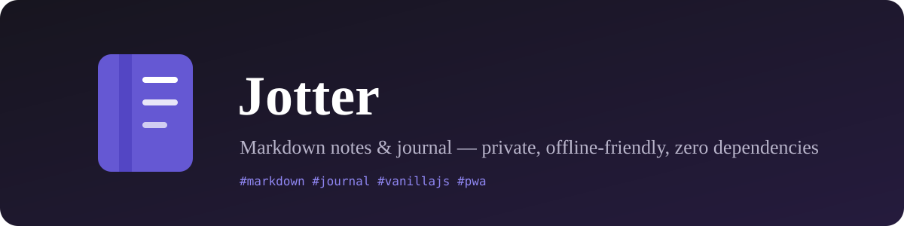

<p align="center">
  
</p>

<h3 align="center">✍️ A fast, private, markdown-powered notes & journal app.<br>Zero dependencies. No accounts, no servers, no tracking.</h3>

<p align="center">
  <a href="https://umairyusufnurgat-cloud.github.io/jotter/"></a>
  <a href="https://codespaces.new/umairyusufnurgat-cloud/jotter"></a>
  <br />
  
  
  
  
</p>

---

## ✨ Features

- 📝 **Markdown everywhere** — headings, **bold**, *italic*, tables, code blocks, blockquotes, task lists…
- ✅ **Interactive checkboxes** — tick a task in the preview and the markdown source updates itself
- ⌘ **Command palette** — `Ctrl`/`⌘` + `K` to fuzzy-jump to any note or run any action from one place
- 🔗 **Wiki-links** — type `[[` to link notes together with autocomplete; clicking a link opens the note or creates it
- ☁️ **GitHub sync** — free private cloud: your notes sync through a secret gist on your own GitHub account (Settings → Sync), manually or automatically
- 🪓 **Split view** — write on the left, see the rendered result on the right (scroll-synced)
- 📑 **Outline** — jump between headings in long notes
- 🧘 **Focus mode** — `Ctrl`/`⌘` + `.` for distraction-free writing
- 🧩 **Templates** — Markdown playground (a live tour of every feature), Today's journal, Meeting notes, Reading notes, Project plan, Brain dump
- 🖼 **Images in notes** — paste screenshots with `Ctrl`/`⌘`+`V` or drag image files in; they're auto-resized and stored locally
- ⏱ **Timestamps** — `Ctrl`/`⌘`+`;` drops in the current date & time
- 📊 **Notebook insights** — words written, journaling streak, activity charts, top tags and storage usage
- 🗓 **Calendar view** — month grid of your writing activity; click a day to see or start that day's entry
- 📏 **Resizable, hideable sidebar** — drag its edge to resize; `Ctrl`/`⌘`+`\` hides it for distraction-free writing
- 🕰 **Version history** — automatic snapshots while you edit; preview and restore any of the last 10 versions (More ▾)
- 🔗 **Share a note as a link** — the whole note rides inside the URL; opening it on any device saves a copy — no account, no server
- 🕸 **Note graph** — see your notes as an interactive map of wiki-links: drag, zoom, pan, click a bubble to open the note
- 🔍 **Find in note** — `Ctrl`/`⌘`+`F` highlights every match in the preview and jumps between them
- 🏷️ **Tags** — organise notes with tag chips, filter by tag, right-click to rename/delete a tag everywhere
- 📌 **Pin & star** the notes that matter; sort by updated / created / title
- 🔍 **Instant search** across titles, bodies, and tags — with match highlighting
- 📅 **Today's journal** — one click creates a dated daily entry with a journal template (and a 🔥 streak counter)
- 📖 **Built-in guide** — press `?` for a getting-started guide, a what-every-button-does reference, and version history
- 🌗 **Light & dark themes** + six accent colours
- 💾 **Private by design** — notes are stored in *your browser's* local storage; nothing ever leaves your device
- 🔄 **Backup & restore** — export all notes to JSON (or as one Markdown file); restore merges them back; drag & drop `.md` files to import them as notes
- ⬇️ **Export any note** as `.md`, or copy its markdown to the clipboard
- 🖨️ **Print / save as PDF** with clean print styles
- 📱 **Responsive + installable** — works great on phones (with a one-tap new-note button); install it as a PWA and it works offline
- ⌨️ **Keyboard shortcuts** for everything
- 🗑️ **Trash** — deleted notes rest for 30 days before being purged

## ☁️ Sync across devices (free, via your GitHub)

Jotter is private by default — notes live in your browser. To carry them to every device:

1. Create a token with the **`gist`** scope only: [github.com/settings/tokens/new?scopes=gist](https://github.com/settings/tokens/new?scopes=gist&description=Jotter%20sync)
2. In Jotter: sidebar → **⚙ Settings → Sync** → paste the token → **Save**
3. **Sync now**, or flip on **Auto-sync** and forget about it

Your notes are stored as a **secret gist** on your own account — unlisted, accessible only with your token. Edits merge with newest-wins per note, and deletions propagate via tombstones. (Secret ≠ encrypted: don't sync anything you wouldn't store on GitHub.)

## 🔗 Link your notes (wiki-links)

Turn your notebook into a personal wiki: type `[[` while writing and pick a note from the autocomplete.
`See [[Meeting — 3 Sep 2026]] for context` becomes a clickable link. A **dashed underline** means the note
doesn't exist yet — clicking it creates the note on the spot.

## 🚀 Launch it

### Option A — GitHub Pages (one-time setup)

The app is 100% static, so hosting it on GitHub Pages takes ~30 seconds:

1. Open the repo on GitHub → **Settings** → **Pages**
2. Under *Build and deployment*, set **Source** to `Deploy from a branch`
3. Branch: `main`, folder: `/ (root)` → **Save**
4. Wait a minute, then open `https://<your-username>.github.io/<repo-name>/`

### Option B — GitHub Codespaces

Click the green **Code** button → **Codespaces** → **Create codespace on main**.
The dev container (`.devcontainer/`) starts a local web server on port **8000** automatically and opens the app in your browser.

> Tip: in Codespaces you can also just right-click `index.html` → *Open with Live Server* if you have that extension.

### Option C — run locally

No build step, no installs:

```bash
git clone https://github.com/umairyusufnurgat-cloud/jotter.git
cd jotter
python3 -m http.server 8000
# → http://localhost:8000
```

(Or use any static server: `npx serve`, `php -S localhost:8000`, VS Code Live Server…)

## ⌨️ Keyboard shortcuts

| Shortcut | Action |
| --- | --- |
| `Ctrl`/`⌘` + `K` | Command palette (search notes & run actions) |
| `Ctrl`/`⌘` + `.` | Focus mode (Esc to exit) |
| `?` | Help & guide |
| `N` | New note (when not typing) |
| `Ctrl`/`⌘` + `Alt` + `N` | New note (from anywhere) |
| `/` | Focus the sidebar search |
| `Ctrl`/`⌘` + `F` | Find in the current note (highlight & jump) |
| `Ctrl`/`⌘` + `E` | Cycle view: Edit → Split → Preview |
| `Ctrl`/`⌘` + `B` / `I` | Bold / italic (wraps selection) |
| `Ctrl`/`⌘` + `;` | Insert timestamp |
| `Ctrl`/`⌘` + `\` | Show / hide the sidebar |
| `Ctrl`/`⌘` + `V` | Paste an image from the clipboard into the note |
| `[[` | Insert a wiki-link (autocomplete popup) |
| `Tab` / `Shift + Tab` | Indent / outdent lines in the editor |
| `Enter` | Continue lists & checkboxes automatically |
| `Ctrl`/`⌘` + `S` | Force save |
| `Esc` | Close menus / palette / modals / focus mode |

💡 Right-click a tag chip in the sidebar to rename it or delete it from all notes.

## 📝 Markdown support

Headings, **bold**, *italic*, ~~strikethrough~~, `inline code`, fenced code blocks (with language label), blockquotes, nested ordered/unordered lists, task lists, tables (with alignment), links, images, autolinks, horizontal rules, and backslash escapes — all rendered by a ~250-line hand-written parser in [`markdown.js`](markdown.js). No libraries, no CDN.

## 💾 Where are my notes?

In your browser's **local storage** — which means:

- ✅ They're private and work offline
- ⚠️ They're tied to the browser + device you used (clearing site data deletes them)

So **use Backup regularly** (sidebar → *Backup*) and keep the JSON file somewhere safe. *Restore* merges a backup into any browser — it's also how you move notes between devices.

## 🛠 Tech

- Vanilla HTML / CSS / JS — **zero dependencies, zero build step**
- ~250-line custom markdown renderer with HTML escaping + URL sanitisation
- Service worker for offline use & PWA installability
- LocalStorage persistence (with an in-memory fallback for sandboxed previews)
- Dev container for Codespaces

```
├── index.html            # app shell
├── styles.css            # full design system (light + dark, responsive, print)
├── markdown.js           # markdown → HTML renderer (incl. wiki-links)
├── app.js                # app logic (state, editor, palette, storage, export…)
├── service-worker.js     # offline cache (bump CACHE when you change files)
├── manifest.webmanifest  # PWA manifest
├── assets/               # icon + banner
├── .devcontainer/        # Codespaces config
└── CHANGELOG.md          # release notes
```

See [CHANGELOG.md](CHANGELOG.md) for what's new in each version.

## 🤝 Contributing

Issues and PRs are welcome! It's plain HTML/CSS/JS — clone, open `index.html` in a browser (or run a static server), and hack away.

## 📄 License

[MIT](LICENSE) — free to use, fork, and make your own.
